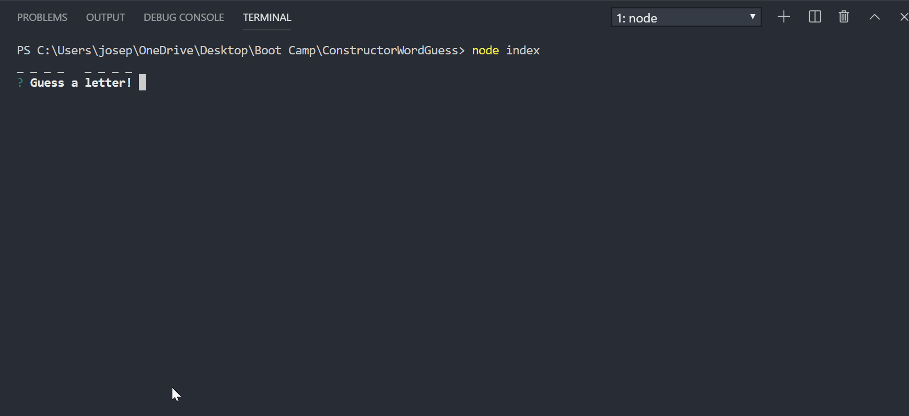

# ConstructorWordGuess

## About

Constructor Word Guess is a command-line game using constructor functions.

## Overview

This is a hangman style word guess game where the user has 9 attempts to guess the word using the correct letters. The theme for this particular Word Guess game relates to famous movie titles.

## Technologies

1. Node.js
2. Inquirer

## Instructions

To run the game, simply install the dependencies and type in the command 'node index' to run it.
Below is a preview of how the game should run.

### Winning

### Losing

